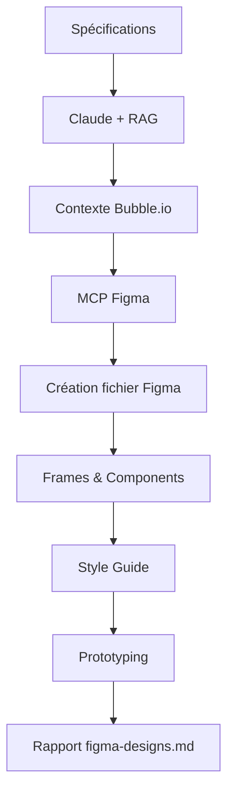

# 🎨 Intégration MCP Figma

Cette documentation explique comment utiliser l'intégration MCP Figma pour générer automatiquement vos designs à partir des spécifications.

## 📋 Table des matières

- [Prérequis](#prérequis)
- [Configuration](#configuration)
- [Utilisation](#utilisation)
- [Fonctionnalités](#fonctionnalités)
- [Troubleshooting](#troubleshooting)

---

## Prérequis

### 1. Serveur MCP Figma

Le serveur MCP Figma doit être configuré dans Claude Code.

**Vérifier si MCP Figma est installé :**
```bash
claude mcp list
```

**Installer MCP Figma (si absent) :**
```bash
claude mcp add --transport http figma https://mcp.figma.com/mcp
```

### 2. Authentification Figma

Après installation, authentifiez-vous :

1. Dans Claude Code, tapez `/mcp`
2. Sélectionnez "figma"
3. Cliquez sur "Authenticate"
4. Autorisez l'accès à votre compte Figma

### 3. Documents générés

La génération Figma nécessite que ces documents soient déjà créés :
- ✅ `user-stories.md`
- ✅ `user-flows.md`
- ✅ `cahier-des-charges.md`
- ✅ `screens-prompts.md`

---

## Configuration

Aucune configuration supplémentaire n'est nécessaire dans le projet. Le générateur Figma utilise automatiquement le serveur MCP configuré dans Claude Code.

---

## Utilisation

### Option 1 : Génération individuelle

```bash
cd bubble-doc-generator
python src/cli.py generate figma
```

Cette commande :
1. Charge tous les documents précédents
2. Utilise le MCP Figma pour créer le fichier
3. Génère un rapport `figma-designs.md` avec le lien Figma

### Option 2 : Workflow complet

```bash
python src/cli.py generate all
```

Le workflow complet génère :
1. User Stories
2. User Flows (diagrammes Mermaid)
3. Cahier des Charges
4. Prompts Écrans
5. **Designs Figma** (optionnel, prompt interactif)

Lorsque vous arrivez à l'étape Figma, vous verrez :

```
============================================================
🎨 GÉNÉRATION FIGMA (optionnel)
============================================================
La génération Figma nécessite le serveur MCP Figma configuré.

Générer les designs Figma ? [O/n] :
```

Tapez **O** (ou Entrée) pour générer, **n** pour ignorer.

---

## Fonctionnalités

### 📊 Ce qui est généré

Le générateur Figma crée automatiquement :

#### 1. **Fichier Figma**
- Nom : `{nom-du-projet} - Designs`
- Structure organisée par pages

#### 2. **Pages créées**

**a) Style Guide**
- Palette de couleurs
- Typographie (titres H1-H6, body, labels)
- Composants réutilisables (buttons, inputs, cards)
- Système de spacing (grille 8px)

**b) User Flows**
- Diagrammes des parcours utilisateurs
- Connexions entre écrans

**c) Screens - Par rôle utilisateur**
- Écrans organisés par rôle (Admin, autres rôles identifiés)
- Frames Desktop (1440x900) et Mobile (375x812)
- Structure : Header, Contenu principal, Footer
- Composants Bubble.io adaptés

**d) Components Library**
- Bibliothèque de composants réutilisables
- Variants pour différents états (default, hover, active, disabled)

#### 3. **Annotations**

Chaque écran inclut des annotations pour :
- Interactions utilisateur (clicks, hovers)
- Workflows Bubble.io à implémenter
- Contraintes techniques
- États alternatifs (loading, error, empty states)

#### 4. **Prototyping**

- Connexions entre écrans (navigation)
- Flows interactifs testables

---

## Workflow de génération



### Processus détaillé

1. **Chargement des specs** : User Stories, Flows, CDC, Screens
2. **Contexte RAG** : Récupération des meilleures pratiques Bubble.io UI/UX
3. **Prompt Claude** : Génération intelligente avec outils MCP
4. **Appels MCP Figma** :
   - `create_file()` - Créer le fichier Figma
   - `create_frame()` - Créer les écrans
   - `add_component()` - Ajouter les composants UI
   - `apply_styles()` - Appliquer les styles
5. **Génération rapport** : Fichier markdown avec lien et instructions

---

## Output

### Fichier généré : `figma-designs.md`

Structure du rapport :

```markdown
# Designs Figma - {Nom du projet}

## 📊 Résumé de la génération
[Détails de la génération par Claude]

## 🎨 Contenu des designs
- Pages créées
- Écrans par rôle
- Annotations

## 🔗 Accès aux designs
[Lien Figma direct]

## ✅ Prochaines étapes
1. Review avec le client
2. Itération selon retours
3. Handoff aux développeurs
4. Développement Bubble.io
```

---

## Troubleshooting

### ❌ Erreur : "MCP Figma non configuré"

**Symptôme :**
```
⚠️  Erreur lors de la génération Figma
💡 Vérifiez que le serveur MCP Figma est bien configuré et authentifié
```

**Solutions :**

1. **Vérifier l'installation :**
   ```bash
   claude mcp list
   ```
   Vous devriez voir `figma` dans la liste.

2. **Ajouter le serveur MCP :**
   ```bash
   claude mcp add --transport http figma https://mcp.figma.com/mcp
   ```

3. **Authentification :**
   - Tapez `/mcp` dans Claude Code
   - Sélectionnez "figma"
   - Cliquez "Authenticate"

4. **Relancer la génération :**
   ```bash
   python src/cli.py generate figma
   ```

### ❌ Erreur : "Fichiers manquants"

**Symptôme :**
```
❌ Fichiers manquants: user-stories.md, cahier-des-charges.md
👉 Exécutez d'abord: python cli.py generate all
```

**Solution :**

Générez d'abord tous les documents préalables :
```bash
python src/cli.py generate all
```

Ou génération par étapes :
```bash
python src/cli.py generate stories
python src/cli.py generate flows
python src/cli.py generate cdc
python src/cli.py generate screens
python src/cli.py generate figma
```

### ⚠️ Designs non satisfaisants

**Si les designs générés ne correspondent pas à vos attentes :**

1. **Affiner les spécifications** :
   - Éditez `screens-prompts.md` pour plus de détails
   - Ajoutez des contraintes visuelles dans le CDC
   - Spécifiez des références de design

2. **Regénérer :**
   ```bash
   python src/cli.py generate figma
   ```

3. **Édition manuelle** :
   - Ouvrez le fichier Figma généré
   - Affinez les designs selon vos besoins
   - Le fichier reste synchronisé avec vos specs

---

## Bonnes pratiques

### ✅ Avant la génération

1. **Specifications détaillées** : Plus vos documents (CDC, Screens) sont précis, meilleurs seront les designs
2. **Transcriptions complètes** : Incluez tous les détails visuels dans les transcriptions clients
3. **Références visuelles** : Mentionnez des exemples de design dans les specs

### ✅ Après la génération

1. **Review immédiate** : Vérifiez les designs générés
2. **Itération** : N'hésitez pas à régénérer si nécessaire
3. **Partage** : Partagez le lien Figma avec l'équipe et le client
4. **Documentation** : Le rapport `figma-designs.md` contient toutes les infos

### ✅ Pour le développement

1. **Export assets** : Utilisez Figma pour exporter images/icônes
2. **Copie des styles** : Figma génère le CSS pour Bubble.io
3. **Mesures précises** : Utilisez l'inspecteur Figma pour les dimensions
4. **Components** : Réutilisez la bibliothèque de composants

---

## Ressources

### Documentation officielle

- [MCP Figma Official Docs](https://www.figma.com/mcp)
- [Claude Code MCP Guide](https://code.claude.com/docs/en/mcp)
- [Bubble.io Design System](https://bubble.io/design-system)

### Vidéos tutoriels

- [Setting up Figma MCP](https://www.youtube.com/watch?v=figma-mcp-setup)
- [Claude Code + Figma Workflow](https://www.youtube.com/watch?v=claude-figma)

### Support

- **Issues GitHub** : [Ouvrir un ticket](https://github.com/votre-repo/issues)
- **Figma Support** : https://help.figma.com
- **Claude Code Support** : https://code.claude.com/support

---

## Exemple complet

### Workflow d'un projet de A à Z

```bash
# 1. Setup initial
cd bubble-doc-generator
python src/cli.py setup --import-transcriptions ../mes-transcriptions/

# 2. Générer tous les documents + Figma
python src/cli.py generate all

# Lors du prompt Figma :
# Générer les designs Figma ? [O/n] : O

# 3. Résultat
# ✅ User Stories : output/user-stories.md
# ✅ User Flows : output/user-flows.md
# ✅ Cahier des Charges : output/cahier-des-charges.md
# ✅ Prompts Écrans : output/screens-prompts.md
# ✅ Designs Figma : output/figma-designs.md

# 4. Ouvrir le lien Figma
cat output/figma-designs.md
# Cliquer sur le lien Figma dans le rapport

# 5. Partager avec l'équipe et développer !
```

---

## Contribuer

Des idées pour améliorer l'intégration Figma ?

- 🐛 Rapporter un bug
- 💡 Proposer une feature
- 📝 Améliorer la doc

Ouvrez une issue ou pull request !

---

**Version** : 1.0.0
**Dernière mise à jour** : 2026-01-06
